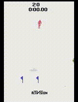

# RL Atari Skiing

## Описание

Вы управляете лыжником, который может двигаться боком. Цель состоит в том, чтобы пробежать все ворота (между столбами) за максимально короткое время. За каждый пропущенный проход вы получаете штраф в размере пяти секунд. Если вы врежетесь в ворота или дерево, ваш лыжник вскочит на ноги и продолжит движение.

## Действия

Skiing имеет такое пространство действия, как Discrete(3): NOOP, LEFT, RIGHT. То есть лыжник может повернуть либо влево, либо вправо или не поворачивать.

## Награды

Секунды - это единственная награда. Отрицательные награды и штрафы (например, за пропущенные ворота) начисляются в качестве дополнительных секунд.

## Точечная оценка

В контексте обучения с подкреплением, точечная оценка \( J \) относится к оценке среднего значения функции вознаграждения (total reward) за определенный период времени или после выполнения определенного количества действий.

Пусть у нас есть последовательность действий, приводящих к наградам $r_1, r_2, \dots, r_n$, где $r_i$ - награда, полученная после выполнения $i$-го действия. Тогда точечная оценка $J$ для этой последовательности может быть вычислена как среднее значение наград:

$J = \frac{1}{n} \sum_{i=1}^{n} r_i$

То есть это просто среднее значение наград за период времени или за определенное количество действий.

## Интервальная оценка

Интервальная оценка $J$ в обучении с подкреплением используется для определения доверительного интервала, который показывает диапазон значений, в котором находится среднее значение функции вознаграждения (total reward) с определенной вероятностью.

После выполнения определенного количества эпизодов обучения и собирания наград, мы можем рассчитать точечную оценку $\hat{J}$ для среднего значения наград. Далее, используя статистические методы, мы можем рассчитать доверительный интервал, который показывает, с какой вероятностью среднее значение наград находится в определенном диапазоне.

Один из наиболее распространенных способов рассчета доверительного интервала - это использование бутстрепа. В бутстрепе мы многократно выбираем случайные выборки из наших данных и повторяем оценку точечной оценки и расчет доверительного интервала на каждой выборке. Затем мы используем распределение полученных оценок, чтобы определить доверительный интервал.

Формально, пусть $\hat{J}$ - это точечная оценка для среднего значения наград, а $\hat{J_1}$, $\hat{J_2}$, $\dots$, $\hat{J_k}$ - это оценки, полученные из бутстреп-выборок. Тогда доверительный интервал с уровнем доверия 1 - $\alpha$ будет определен как интервал между ${\hat{J}_{a/2}}$ и ${\hat{J}_{1-a/2}}$, где $\alpha$ - это уровень значимости (обычно 0.05 для 95% доверительного интервала).

Интервальная оценка позволяет учитывать неопределенность и изменчивость в данных и предоставляет более информативную оценку среднего значения наград в обучении с подкреплением.

# Политики/алгоритмы, примененные для обучения 

## 1. Эпсилон-жадная стратегия (epsilon-greedy policy)

Жадный алгоритм можно определить как алгоритм, который выбирает наилучший доступный в настоящее время вариант без учета долгосрочных последствий этого решения, которое может оказаться неоптимальным. Учитывая это, мы можем определить эпсилон-жадный алгоритм как жадный алгоритм, который добавляет некоторую случайность при выборе между вариантами: вместо того, чтобы всегда выбирать лучший доступный вариант, случайным образом исследуйте другие варианты с вероятностью = $e$ или выбрать лучший вариант с вероятностью = 1 - $e$. Поэтому мы можем добавить в алгоритм случайности, увеличив e, что заставит алгоритм чаще исследовать другие варианты.

Изменение Q-значения в обновлении Q-функции используется TD (temporal difference) обучение, это обновление сочетает в себе методы TD и метод обучения с подкреплением, известный как Q-обучение.

$Q(a) \leftarrow Q(a) + \alpha \left( r + \gamma \max_{a'} Q(a') - Q(a) \right)$

Формула выше обновляет $Q(a)$ в направлении, которое учитывает текущую награду, максимальное ожидаемое будущее вознаграждение и текущую оценку $Q(a)$.

## Пример развернутой среды (в виде траектории), используя стратегию epsilon-greedy

